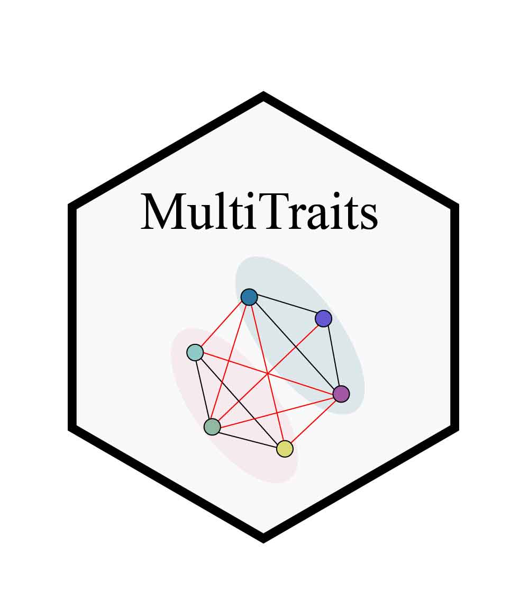
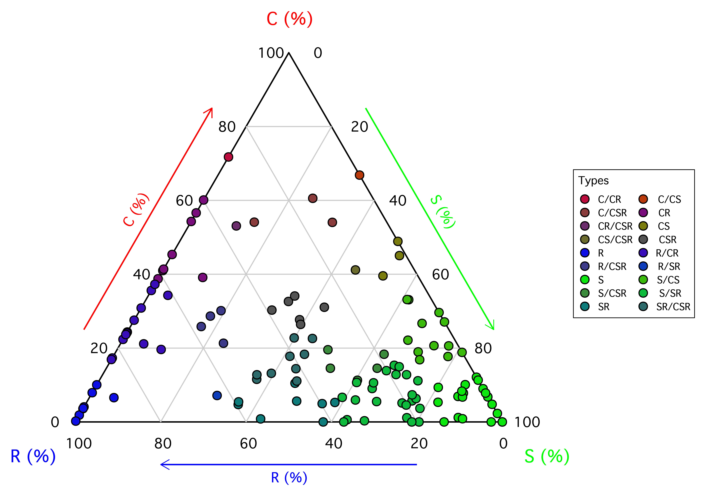
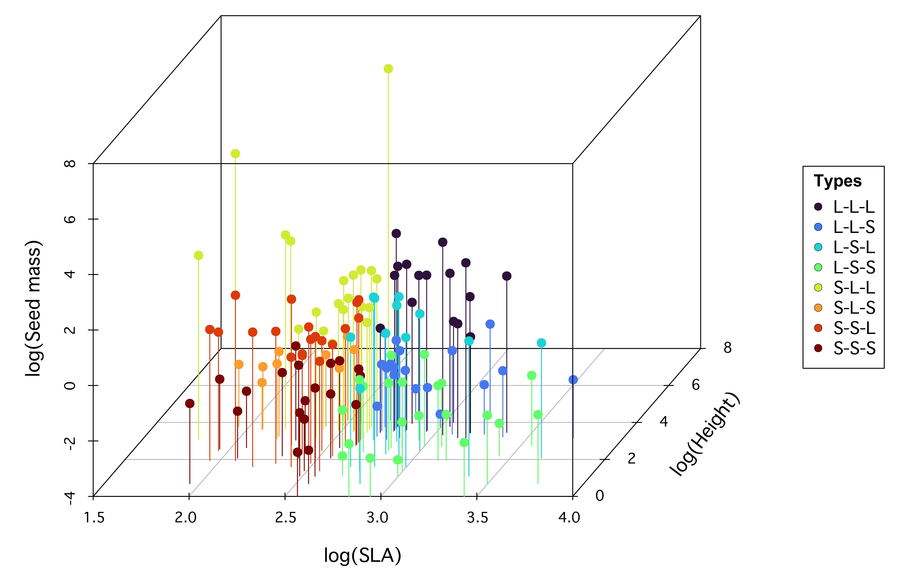
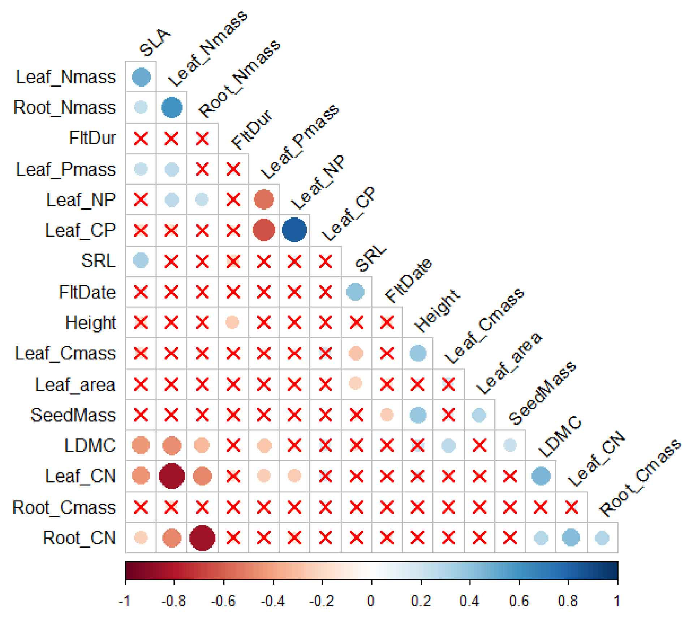
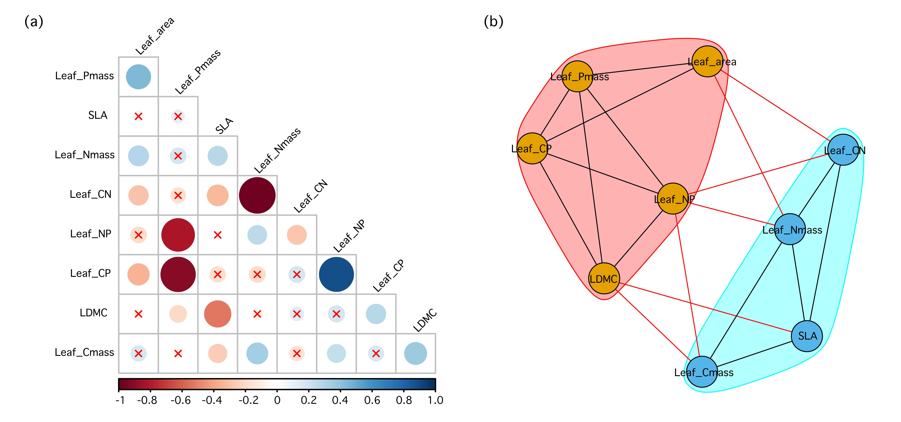

# MultiTraits

MultiTraits is a comprehensive R package designed for advanced analysis and visualization of multidimensional plant traits. It provides a standardized workflow and intuitive visualization tools, streamlining the exploration of complex trait relationships for researchers, educators, and students. The package integrates four key analytical modules: Competitors–Stress Tolerators–Ruderals (CSR) strategy analysis, Leaf–Height–Seed (LHS) strategy analysis, Niche Periodic Table (NPT) analysis, and Plant Trait Network (PTN) analysis. These modules offer complementary perspectives, fostering a more comprehensive understanding of multidimensional trait variation patterns in plants. This tutorial aims to guide users through the core functionalities and practical applications of the MultiTraits package. Through hands-on demonstrations, we show how these analytical modules can be used to explore multidimensional relationships among plant traits, including essential steps in data preparation, analysis workflows, and results visualization.


## Installation

### From CRAN (recommended)

```{r,class.source = 'fold-show'}
# install.packages("MultiTraits")
```

### From GitHub (development version)

```{r,class.source = 'fold-show'}
# if (!requireNamespace("devtools", quietly = TRUE)) {install.packages("devtools")}
# devtools::install_github("biodiversity-monitoring/MultiTraits")
```

## Main Functions

| Module         | Function                | Description                                                                                                                           |
|----------------|----------------|-----------------------------------------|
| **CSR Module** | `CSR()`                 | Classifies plant species' CSR ecological strategies based on leaf traits (LA, LDMC, and SLA) using the Pierce et al. (2017) method.   |
|                | `CSR_hodgson()`         | Implements the Hodgson et al. (1999) method for CSR classification.                                                                   |
|                | `CSR_plot()`            | Provides advanced ternary plot visualizations for CSR analysis to explore plant adaptation to different environments.                |
| **LHS Module** | `LHS()`                 | Analyzes LHS strategies using SLA, plant height, and seed mass.                                                                       |
|                | `LHS_plot()`            | Visualizes three-dimensional trait distributions in LHS space.                                                                        |
|                | `LHS_strategy_scheme()` | Classifies strategies based on the LHS scheme.                                                                                        |
| **NPT Module** | `NPT_discrete()`        | Supports discrete niche classification schemes. Performs PCA and clustering (CART or K-means) to group species within each dimension. |
|                | `NPT_discrete_plot()`   | Visualizes the discrete niche classification scheme.                                                                                  |
|                | `NPT_continuous()`      | Supports continuous niche classification schemes. Performs a hierarchical PCA approach.                                               |
|                | `NPT_continuous_plot()` | Visualizes the results of the continuous niche classification.                                                                        |
| **PTN Module** | `PTN_corr()`            | Offers correlation computation and visualization for trait networks.                                                                  |
|                | `PTN()`                 | Generates trait correlation networks.                                                                                                 |
|                | `PTN_metrics()`         | Quantifies network metrics for trait networks.                                                                                        |
|                | `PTN_plot()`            | Visualizes the trait network graph.                                                                                                   |

### Example Datasets: PFF (Pine Forests Flora)

The package includes a built-in example dataset called PFF that can be loaded as follows:

```{r,class.source = 'fold-show'}
library(MultiTraits)
data(PFF)
# View the structure of the datasets
head(PFF)
```

The PFF dataset contains trait measurements for plant species found in pine forests, with the following variables:

Height: Maximum plant height (cm)

Leaf_area: Leaf area (mm2)

LDMC: Leaf dry matter content (%)

SLA: Specific leaf area (mm2/mg)

SRL: Specific root length (m/g)

SeedMass: Seed mass (mg)

FltDate: Mean flowering date (Julian day)

FltDur: Mean flowering duration (days)

k_value: Decomposition decay constant, where proportion of original mass remaining = exp(- k-value*0.926)

Leaf_Cmass: Leaf carbon content (%)

Leaf_Nmass: Leaf nitrogen content (%)

Leaf_CN: Leaf carbon/nitrogen ratio

Leaf_Pmass: Leaf phosphorus content (%)

Leaf_NP: Leaf nitrogen/phosphorus ratio

Leaf_CP: Leaf carbon/phosphorus ratio

Root_Cmass: Root carbon content (%)

Root_Nmass: Root nitrogen content (%)

Root_CN: Root carbon/nitrogen ratio

### CSR Strategy

The CSR (Competitor–Stress-Tolerator–Ruderal) strategy, initially conceptualized by Grime (1974), classifies plants based on their ecological strategies, which are influenced by environmental factors such as competition, stress, and disturbance. The MultiTraits package offers two approaches for CSR analysis: the method proposed by Hodgson et al. (1999) and the method developed by Pierce et al. (2017). The Pierce method, used here, employs leaf area (LA), leaf dry matter content (LDMC), and specific leaf area (SLA) to classify species. The CSR_plot() function visualizes the results in a ternary plot, showing species’ positions based on their relative C, S, and R strategy proportions. This aids in understanding plant functional classification and predicting responses to environmental changes.

```{r,class.source = 'fold-show'}
# Load packages
library(MultiTraits)
# Load the PFF dataset
data(PFF)
head(PFF)

# Create a data frame with the CSR traits
csr_traits <- data.frame(LA=PFF$Leaf_area, LDMC=PFF$LDMC, SLA=PFF$SLA)
rownames(csr_traits) <- PFF$species
head(csr_traits)

# Perform CSR analysis
csr_result <- CSR(csr_traits)
head(csr_result)

# Create the CSR plot
CSR_plot(csr_result)
```



### LHS Strategy

The Leaf–Height–Seed (LHS) scheme, proposed by Westoby (1998), classifies plant species based on specific leaf area (SLA), canopy height at maturity, and seed mass. These three traits reflect trade-offs in resource acquisition, spatial occupation, and reproductive investment. The MultiTraits package implements the LHS scheme by positioning species in a three-dimensional trait space using log-transformed trait values. This continuous space is then divided into eight discrete strategy types (e.g., S–S–S, L–L–L) based on median trait values, representing different trade-offs in growth, competition, and survival. The LHS_plot() function visualizes these strategies in 3D space, while LHS_strategy_scheme() provides a reference key for interpreting the strategy types.

```{r,class.source = 'fold-show'}
# Load packages
library(MultiTraits)
# Load the PFF dataset
data(PFF)
head(PFF)

# Create a data frame with the LHS traits
lhs_traits <- PFF[, c("SLA", "Height", "SeedMass")]
rownames(lhs_traits) <- PFF$species
head(lhs_traits)

# Perform LHS analysis
lhs_result <- LHS(lhs_traits)
head(lhs_result)
table(lhs_result$LHS_strategy)


# Create a visualization plot of the LHS analysis results
LHS_plot(lhs_result, group = "LHS_strategy", show_cube = TRUE)

# Display the LHS strategy scheme diagram
LHS_strategy_scheme()
```



### Niche Periodicity Table

The Niche Periodic Table (NPT) framework systematically describes and predicts species functions by identifying recurring trait combinations driven by convergent evolution. Within the MultiTraits R package, the NPT module offers both discrete and continuous classification schemes. The NPT_discrete() function categorizes species into distinct niche groups using PCA and clustering, with NPT_discrete_plot() visualizing the results. For continuous classification, NPT_continuous() performs hierarchical PCA to create a two-dimensional ordination space, while NPT_continuous_plot() visualizes these integrated niche patterns.

```{r,class.source = 'fold-show'}
# Load packages
library(MultiTraits)
# Load and prepare data
data(PFF)
rownames(PFF) <- PFF$species
PFF_traits <- PFF[, c("SLA", "SRL", "Leaf_Nmass", "Root_Nmass","Height",
                      "Leaf_CN", "Root_CN","SeedMass", "FltDate", "FltDur")]
# Perform log transformation of data and remove missing values
PFF_traits <- log(na.omit(PFF_traits))
head(PFF_traits)

# Define trait dimensions
dimension <- list(
  Grow = c("SLA", "SRL", "Leaf_Nmass", "Root_Nmass"),
  Survive = c("Height", "Leaf_CN", "Root_CN"),
  Reproductive = c("SeedMass", "FltDate", "FltDur")
)

# Perform discrete niche scheme
set.seed(123)
discrete_result <- NPT_discrete(data = PFF_traits, dimension = dimension)
discrete_result
NPT_discrete_plot(discrete_result$niche_classification)

# Perform continuous niche scheme
continuous_result <- NPT_continuous(data = PFF_traits, dimension = dimension)
continuous_result 
NPT_continuous_plot(continuous_result$result)
```



### Plant Trait Network

Plant Trait Networks (PTNs) provide a framework for understanding complex interdependencies among plant traits by treating traits as nodes and their associations as edges within a network. The PTN module, implemented as described by He et al. (2020), offers functions to calculate correlations (PTN_corr()), generate networks (PTN()), quantify network metrics (PTN_metrics()), and visualize networks (PTN_plot()). The package supports phylogenetic correction to account for species’ shared evolutionary history. Significant correlations are selected based on defined thresholds, and network metrics, including both node-level and network-level parameters, are used to analyze trait interdependence.

```{r,class.source = 'fold-show'}
# Load packages
library(MultiTraits)
# Load and prepare data
data(PFF)
rownames(PFF) <- PFF$species
PFF_traits <- PFF[, c("Leaf_area","LDMC","SLA", "Leaf_Cmass","Leaf_Nmass",
                      "Leaf_CN","Leaf_Pmass", "Leaf_NP","Leaf_CP")]
# Perform log transformation of data and remove missing values
PFF_traits <- log(na.omit(PFF_traits))
head(PFF_traits)

data(PFF_tree)
PFF_tree

# Calculate trait correlations using specified thresholds
PTN_corr(traits_matrix=PFF_traits, rThres = 0.2, pThres = 0.05,method = "pearson",
         phylo_correction = TRUE,phylo_tree = PFF_tree)

# Perform Trait Network (TN) analysis
PTN_phylo_result <- PTN(traits_matrix = PFF_traits,
                      rThres = 0.2,
                      pThres = 0.05,
                      method = "pearson",
                      phylo_correction = TRUE,
                      phylo_tree = PFF_tree)

# Calculate network metrics for the trait network
PTN_metrics(PTN_phylo_result)

set.seed(22)
# Create visualization plots of the trait network
PTN_plot(PTN_phylo_result, style = 1, vertex.size = 20, vertex.label.cex = 0.6)
```


